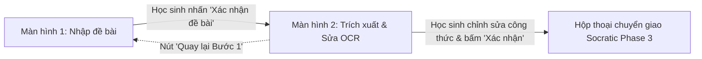

# ỨNG DỤNG TÍCH HỢP HOÀN CHỈNH SOCRATES NHÍ
> **Dự án:** Socrates Nhí v3.0 — Trợ lý AI gợi mở tư duy Khoa học tự nhiên THCS  
> **Cuộc thi:** Sáng tạo trẻ Quốc gia trong lĩnh vực Trí tuệ nhân tạo năm 2026 — Bảng A (THCS)  
> **Trạng thái:** ✅ Đã kết hợp hoàn chỉnh Chức năng 1 (FR-01) & Chức năng 2 (FR-02)

---

## 1. Kiến trúc Tổ chức Dự án
Dự án được phân chia mô-đun khoa học đúng theo yêu cầu:
1. **Các chức năng độc lập (Phục vụ nộp bài / chấm điểm từng phần)**:
   - 📁 [`chuc_nang_1_nhap_de/`](../chuc_nang_1_nhap_de/): Chức năng 1 — Tiếp nhận đề bài (Văn bản & Tải ảnh JPG/PNG $\le 5\text{ MB}$, An toàn PII).
   - 📁 [`chuc_nang_2_ocr_xac_nhan/`](../chuc_nang_2_ocr_xac_nhan/): Chức năng 2 — Trích xuất OCR & Xác nhận nội dung công thức KHTN ($H₂O, CO₂, v², km/h$, Đo độ nét ảnh).
2. **Ứng dụng tích hợp hoàn chỉnh (Phục vụ tương tác toàn diện với học sinh)**:
   - 📁 [`app_tich_hop_socrates/`](./): Kết hợp Chức năng 1 và Chức năng 2 thành một ứng dụng Flet Desktop hoàn chỉnh, điều phối trạng thái liên tục và chuyển cảnh mượt mà.

---

## 2. Luồng trải nghiệm tương tác liền mạch của học sinh



### Bước 1: Tiếp nhận đề bài
- Học sinh lựa chọn gõ đề bài văn bản, tải ảnh bài tập chụp từ sách/vở, hoặc chọn nhanh từ ngân hàng đề mẫu KHTN 7 (3 mạch kiến thức).
- Hệ thống kiểm tra dung lượng $\le 5\text{ MB}$, định dạng ảnh và nhắc nhở an toàn PII.
- Khi học sinh bấm **"Xác nhận đề bài này"**, dữ liệu được đóng gói và **tự động chuyển cảnh sang Bước 2**.

### Bước 2: Trích xuất OCR & Biên tập công thức KHTN
- **Nếu đầu vào là ảnh**: Ứng dụng tự động đo độ sắc nét (hiển thị huy hiệu `Độ nét: 98% (Rõ nét)`), trích xuất chữ và công thức. Nếu ảnh mờ $\rightarrow$ thông báo từ chối lịch sự, không đoán mò.
- **Nếu đầu vào là văn bản**: Ứng dụng chuẩn hóa công thức Unicode và đưa ngay vào trình soạn thảo.
- **Thanh ký hiệu KHTN nhanh**: Học sinh bấm 1 chạm để chèn nhanh các ký tự đặc biệt ($H₂O, CO₂, O₂, v², km/h, m/s, N, \rightarrow, ^\circ C, g, kg, ^2, ^3$).
- **Khung xem trước trực quan (Live Preview)**: Tự động cập nhật định dạng công thức theo thời gian thực khi học sinh gõ sửa.
- Có nút *"Quay lại Bước 1"* nếu học sinh muốn chọn lại ảnh khác.

### Bước 3: Xác nhận & Chuyển giao
- Học sinh bấm **"Xác nhận đề bài để bắt đầu học"** $\rightarrow$ Hệ thống kích hoạt Modal thông báo thành công và chốt đề bài chuẩn hóa, sẵn sàng kết nối bộ điều phối Socratic 5 pha.

---

## 3. Cách khởi chạy ứng dụng tích hợp

Mở terminal tại thư mục gốc của dự án và chạy:
```powershell
python app_tich_hop_socrates/run_app.py
```
Hoặc:
```powershell
python app_tich_hop_socrates/main_app.py
```
Cửa sổ ứng dụng **Socrates Nhí** hoàn chỉnh sẽ mở lên để bạn tương tác trực tiếp từ đầu đến cuối!
